ANALYZING THE RELATIONSHIP OF FEW POVERTY INDICATORS IN THE PHILIPPINES BY REGION

**A Course Requirement for the Subject Data Science and Artificial Intelligence**

**Submitted by:** 
*T4A - Group 3*
- Arellano, Aldrich E.
- Coronel, Ericka May B.
- Fadol, Noelle Joshua N.
- Mendoza, Joshua Jericho L.

**Submitted to:** Labastilla, Aisa M.

**Date:** January 23, 2024

## I.	Introduction / Problem Statement
In the intricate web of the Philippine socio-economic landscape, the persistent challenge of poverty poses an obstacle, hindering the nation's path to comprehensive development. Despite commendable economic growth, poverty endures, characterized by low income, constrained employment opportunities, and limited access to essential services. 

Aligning itself with the global commitment encapsulated in the Sustainable Development Goal (SDGs), the Philippines underscores its dedication to fostering a more equitable society. Embracing the principles of SDG 1: "No Poverty," the nation recognizes the importance of eradicating all facets of poverty, ensuring that every individual has equal access to the essentials necessary for a dignified life.

In the fabric of a nation's economic landscape, one of the pivotal contributors is the rural economy, wielding both the potential for prosperity and the challenges of poverty. Rooted in the vast expanses beyond urban centers, the rural economy encompasses a diverse range of agricultural activities, non-farm enterprises, and local industries. Its significance extends far beyond the idyllic scenes of farmland, encompassing the livelihoods of a substantial portion of the population.
  
For the Philippines, rural economies is considered as the backbone of the agricultural sector, nurturing the cultivation of crops and the rearing of livestock that form the bedrock of food security. Beyond agriculture, these economies host a spectrum of non-farm activities, from small-scale enterprises to traditional crafts, creating a web of interconnected economic activities that sustains communities.

However, while the rural economy is a wellspring of economic contributions, it also grapples with the shadows of poverty. The challenges are manifold, encompassing factors such as limited access to resources, market fluctuations, and vulnerability to climate change. As a result, a significant proportion of the rural populace contends with lower income levels, constrained employment opportunities, and disparities in access to essential services. In relation to this, understanding the dynamics of the rural economy as a contributor to both economic growth and poverty is essential for crafting effective policies.

Income disparities in the rural economy serve as a testament to the pervasive hold of poverty, as a significant portion of the population remains below the national poverty line. Limited stable employment opportunities increase vulnerability, exposing individuals and families to a state of socio-economic instability. With these, a more in-depth analysis of these indicators, including rural income, agricultural wages, non-farm income, and employment, will be undertaken to glean a comprehensive understanding of the factors contributing to the issue of poverty for targeted and effective interventions to address the root causes and foster inclusive progress.

## II. Review of Related Literature
The review of related literature is a critical component of any research endeavor, serving as the intellectual foundation upon which a study is built. This section provides a comprehensive examination of existing scholarly works, theories, and empirical studies relevant to the poverty of the Philippines, highlighting the rural or agricultural income. By delving into the wealth of knowledge already available, the proponents gain insights and establishes the context within which the current study contributes.

**Defining Poverty**

Poverty is a pervasive and complex socio-financial phenomenon that continues to task countries international, affecting tens of millions of people and communities. In modern-day discourse, poverty is generally defined as a multifaceted state or circumstance marked through the insufficient financial sources that restrict individuals, families, and groups from attaining a minimum widespread of living critical for a thriving existence. This deprivation extends beyond earnings constraints, encompassing the incapability to access fundamental requirements including decent housing, clean water, nutritious meals, and critical healthcare. The complexity of poverty is underscored by its correlation with various factors, which include race, sexual identity, sexual orientation, and constrained academic opportunities [[1]](https://www.investopedia.com/terms/p/poverty.asp)

The World Bank Organization describes poverty in this way: “Poverty is hunger. Poverty is lack of shelter. Poverty is being sick and not being able to see a doctor. Poverty is not having access to school and not knowing how to read. Poverty is not having a job, is fear for the future, living one day at a time. Poverty has many faces, changing from place to place and across time, and has been described in many ways.  Most often, poverty is a situation people want to escape. So, poverty is a call to action - for the poor and the wealthy alike - a call to change the world so that many more may have enough to eat, adequate shelter, access to education and health, protection from violence, and a voice in what happens in their communities” [[2]](https://disasterphilanthropy.org/resources/people-experiencing-poverty/).

**Determinants of Poverty**

Poverty indicators are measurable and quantifiable variables that provide insights into the monetary, social, and typical well-being of people, households, or communities, aiding in the assessment of their living requirements and the volume in their deprivation. These indicators serve as critical gear for identifying, studying, and addressing poverty.

Income inequality stands as a pivotal determinant within the complex panorama of poverty. There are studies that underscore a compelling correlation among heightened earnings inequality and escalating poverty rates. The usage of the Gini coefficient, an extensively standard metric for gauging earnings distribution, continually famous that nations characterized with the aid of reported profits disparities simultaneously grapple with increased tiers of poverty [[3]](https://www.investopedia.com/terms/g/gini-index.asp).

The perpetuation of poverty cycles is substantially influenced by using racial and ethnic disparities, as illuminated by latest investigations led by Beech, et al. (2020). These studies emphasize the lifestyles of systemic boundaries that disproportionately affect minority agencies, resulting in an augmented susceptibility to poverty. The unequal apportionment of possibilities and assets among awesome racial and ethnic communities exacerbates pre-current financial inequalities [[4]](https://www.frontiersin.org/articles/10.3389/fpubh.2021.699049/full).

The feminization of poverty is propelled by gender-based wage gaps, limited access to education, and restricted employment opportunities, as articulated by Duflo (2012). Kabeer (2016) have conducted contemporary studies that delve into the nuanced challenges of gender disparities, shedding light on the dynamic nature of poverty concerning gender [[5]](https://economics.mit.edu/sites/default/files/2022-08/Women%20Empowerment%20and%20Economic%20Development%202012.pdf) [[6]](https://sci-hub.se/https://doi.org/10.1080/13545701.2015.1090009).

The intricate relationship between urbanization, migration, and poverty introduces a nuanced layer to poverty dynamics. Recent scholarly contributions by Glaeser, Kahn, & Rappaport (2019) and Henderson (2019) provide insights into the contemporary challenges and opportunities arising from urbanization in the context of poverty. Glaeser, Kahn, & Rappaport (2019) delve into the multifaceted aspects of urban development and its implications for economic disparities, while Henderson (2019) explores the intricate relationship between urbanization and poverty dynamics. As global trends continue to shift towards increased urbanization, a comprehensive understanding of the complex interplay between urban development and poverty becomes essential for formulating sustainable urban policies [[7]](https://chicagounbound.uchicago.edu/cgi/viewcontent.cgi?article=1045&context=housing_law_and_policy) [[8]](https://www.researchgate.net/publication/5149931_The_Urbanization_Process_and_Economic_Growth_The_So-What_Question).

**Impacts of Poverty**

Poverty, a pervasive and enduring international undertaking, extends its a long way-accomplishing implications throughout people, communities, and entire societies. The complicated courting among poverty and health has garnered extensive attention in modern research. Siddiqi et al. (2017) and Patel et al. (2018) contribute to this information, elucidating the unfavorable results of poverty on both physical and mental well-being. Individuals ensnared in poverty frequently deal with better quotes of continual illnesses, intellectual health problems, and face boundaries to having access to important healthcare offerings. This nexus between poverty and fitness underscores the urgent need for comprehensive interventions that address the health disparities perpetuated by means of financial deprivation [[9]](https://equityhealthj.biomedcentral.com/articles/10.1186/s12939-015-0251-2) [[10]](https://www.ncbi.nlm.nih.gov/pmc/articles/PMC5775138/).

Recent investigations by using Duncan and Murnane (2014) and Hanushek and Woessmann (2015) delve into the tricky instructional influences of poverty. These studies resolve a cyclical project in which poverty acts as a barrier to great education, while restricted academic attainment, in turn, perpetuates the cycle of poverty. The persisting hole in educational effects for youngsters from impoverished backgrounds accentuates the urgency of centered educational guidelines to break the vicious cycle and foster identical opportunities for all [[11]](https://www.researchgate.net/publication/262895874_Whither_Opportunity_Rising_Inequality_Schools_and_Children's_Life_Chances_by_Greg_J_Duncan_and_Richard_J_Murnane_Eds) [[12]](https://mitpress.mit.edu/9780262548953/the-knowledge-capital-of-nations/).

Beyond limiting get right of entry to opportunities, poverty resonates profoundly in the financial realm. Krause and Rinne (2015) and Edmonds and Schady (2012) illuminate the cyclical nature of poverty, in which limited financial resources occur as diminished employment opportunities. This cycle exacerbates financial hardships for affected people and households, reinforcing the imperative for economic guidelines that deal with the basis causes of poverty and stimulate sustainable economic boom [[13]](https://docs.iza.org/dp3911.pdf)  [[14]](https://www.aeaweb.org/articles?id=10.1257/pol.4.4.100).

The social and mental toll exacted with the aid of poverty emerges as a poignant theme in current studies through Mani et al. (2013) and Helliwell et al. (2020). This research finds the pervasive stress and stigma associated with poverty, contributing to social isolation and an average faded sense of proper-being. Individuals grappling with poverty regularly bear the weight of shame and feelings of inadequacy, in addition impeding their capability to break unfastened from the entwining cycle of deprivation. Understanding and addressing the social and psychological dimensions of poverty are essential for designing holistic interventions that empower people to triumph over the challenges posed via financial adversity [[15]](https://www.science.org/doi/abs/10.1126/science.1238041) [[16]](https://www.internationaljournalofwellbeing.org/index.php/ijow/article/view/9).

The inter-generational transfer of poverty takes center level in research through Dahl and Lochner (2012) and Almond et al. (2014). These studies light up the iconic results confronted with the aid of youngsters born into impoverished environments, where the cycle of poverty is perpetuated across generations. Recognizing the long-time period implications of poverty underscores the significance of interventions that break this inter-generational cycle, fostering opportunities for future generations to escape the clutches of financial deprivation [[17]](https://www.aeaweb.org/articles?id=10.1257/aer.102.5.1927) [[18]](https://direct.mit.edu/rest/article-abstract/93/2/387/58599/Inside-the-War-on-Poverty-The-Impact-of-Food?redirectedFrom=fulltext).

**Poverty Dynamics in the Philippines**

According to the Preliminary Results of the Family Income and Expenditure Survey (FIES) in 2021, the poverty incidence among the population, defined as the percentage of Filipinos with per capita income insufficient to meet basic food and non-food needs, stood at 18.1 percent. This equates to approximately 19.99 million Filipinos living below the poverty threshold of PhP 12,030 per month for a family of five. The subsistence incidence, representing the proportion of Filipinos with income inadequate for basic food needs, saw a slight increase to 5.9 percent in 2021. It was estimated that a family of five requires at least PhP 8,379 per month to fulfill their basic food requirements). In terms of families, approximately 3.50 million families, or 13.2 percent, were deemed poor in 2021. Conversely, the subsistence incidence among families was noted at 3.9 percent, equivalent to 1.04 million families falling below the food poverty line. Figure 1 shows this poverty and subsistence incidence statistics in the Philippines from 2015-2018 [[19]](https://psa.gov.ph/content/proportion-poor-filipinos-was-recorded-181-percent-2021). 

  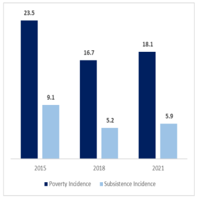
   
  <em>Figure 1. Poverty and Subsistence Incidence Among Population, Philippines: Full Year 2015, 2018, and 2021 [19]</em> 

According to the most recent official data released by the Philippine Statistics Authority (PSA), a greater number of Filipinos find themselves in impoverished conditions today compared to 2018. The PSA, drawing on its Family Income and Expenditure Survey, reported that 19.99 million individuals, constituting 18.1 percent of the population, are living below the poverty threshold. In 2018, the count stood at 17.67 million impoverished Filipinos. Concurrently, there has been a rise of 1.01 million in the number of individuals categorized as "food-poor." Additionally, the PSA highlighted a 7.8 percent unemployment rate, translating to 3.71 million Filipinos currently without employment [[19]](https://psa.gov.ph/content/proportion-poor-filipinos-was-recorded-181-percent-2021).

It is worth noting that the poverty scenario may be even more severe, given that the PSA conducted its survey in 2021, and some experts consider its poverty threshold unrealistic. As per the Philippine government's perspective, an individual from a family of five members is deemed to require only $1.41 per day, when converted into U.S. dollars, to sustain themselves and fulfill their daily nutritional needs [[20]](https://thediplomat.com/2022/09/making-sense-of-the-philippines-latest-poverty-statistics/). To have a better grasp of the poverty in the country, presented in Figure 2 is the trend of the poverty rate in the Philippines compared to the world poverty rate[[21]](https://www.macrotrends.net/countries/PHL/philippines/poverty-rate#:~:text=Philippines%20poverty%20rate%20for%202021,a%201.2%25%20decline%20from%202009) [[22]](https://www.macrotrends.net/countries/WLD/world/poverty-rate#:~:text=World%20poverty%20rate%20for%202019,a%200.9%25%20decline%20from%202015).

  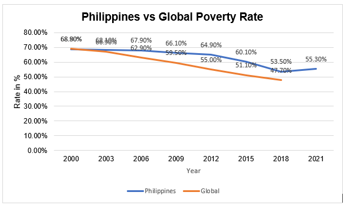
   
  <em>Figure 2. Philippines vs Global Poverty Rate (2000-2021) [21][22]</em> 

Figure 2 presents the Philippine poverty rate over a span of two decades, from 2000 to 2021, along with the corresponding percentage change. In 2021, the poverty rate stands at 55.30%, indicating a 1.80% increase compared to the rate in 2018. Interestingly, the year 2018 saw a decrease in the poverty rate of 6.60% from 2015. The trend continues with a further reduction of 4.80% between 2015 and 2012. Notably, the poverty rate has demonstrated a declining pattern since 2000, with successive decreases in each recorded interval. However, comparing this to the world poverty rate, it is revealed that the country is experiencing a worse scenario as it falls below the global rate. 

From 2012 to 2009, there is a marginal reduction of 1.20% in the poverty rate, and a similar trend persists between 2009 and 2006, where the rate decreases by 1.80%. The years 2006 to 2003 witness a minor decrease of 0.20%, followed by a comparable reduction of 0.70% between 2003 and 2000.

While the poverty rate in 2021 has shown a slight increase compared to 2018, the overall trajectory over the past two decades reveals a positive trend of decreasing poverty rates in the Philippines. The periodic fluctuations suggest that, although progress has been made, addressing and sustaining poverty reduction efforts remain crucial for fostering long-term socioeconomic development in the country.

The COVID-19 pandemic significantly influenced poverty levels in the Philippines. In 2020, the pandemic disrupted economic progress, resulting in a surge in unemployment rates. This pattern persisted into 2021, causing poverty rates to increase, impacting nearly 20 million individuals (World Bank). Despite ongoing economic recovery, the improvement is unevenly distributed, and the most impoverished households experience the least benefit. While many regions are returning to pre-pandemic conditions, communities in remote areas face persistent challenges in restoring their economies, struggling to reach even the prior, already difficult, levels [[23]](https://blogs.worldbank.org/developmenttalk/covid-19-leaves-legacy-rising-poverty-and-widening-inequality).

Amidst the difficult tapestry of monetary improvement, social disparities, and structural inequalities, poverty maintains to pose an impressive and continual challenge inside the Philippines. Drawing insights from current scholarly works, the assessment seeks to unravel the complicated elements contributing to the endurance of poverty, while simultaneously providing a glimpse into potential pathways for sustainable relief.

Reyes and Tabuga's (2015) comprehensive study explores the modern panorama of poverty in the Philippines. Unlike simplistic statistical measures, their research provides a nuanced exploration of poverty by dissecting various factors. One key focus is on income distribution, revealing the disparities that exist among different segments of the population. By examining local disparities, the study sheds light on how poverty manifests itself differently in various regions of the country. Additionally, Reyes and Tabuga scrutinize temporal changes, allowing for a dynamic understanding of poverty trends over time [[24]](https://serp-p.pids.gov.ph/serp-p/download.php?d=5167&s=3). 

The contribution of a publication by Asian Development Bank (2009) adds to the richness of insights into the modern landscape of poverty in the Philippines. Going beyond conventional analyses, their research conducts thorough examinations of factors influencing poverty. The income distribution patterns was explored, revealing not just the presence of poverty but also the disparities in how economic resources are distributed among different socioeconomic groups. They were able to understand local disparities, recognizing the diversity of challenges faced by various communities. Additionally, the publication considers temporal changes, providing a dynamic perspective on how poverty evolves [[25]](https://www.adb.org/sites/default/files/publication/27529/poverty-philippines-causes-constraints-opportunities.pdf).

A study by Fabella, R. (2014) delves deeply into the transformative impact of urbanization on poverty dynamics within the Philippine context. The study emphasizes the profound changes in livelihoods accompanying the shift from rural to urban settings. By examining this transition, Fabella sheds light on the intricate interplay of factors influencing poverty in the country. The research goes beyond surface-level observations, providing a nuanced understanding of the challenges and opportunities that emerge as individuals and communities transition from rural to city life. Fabella's insights contribute significantly to the broader discourse on urbanization and its implications for poverty alleviation strategies [[26]](https://documents1.worldbank.org/curated/en/963061495807736752/pdf/114088-REVISED-PUBLIC-Philippines-Urbanization-Review-Full-Report.pdf).

As revealed by Orbeta (2017) there is an intricate relationship between employment styles and the dynamics of poverty. By focusing on the prevalence and implications of casual labor, he shed light on how different forms of employment significantly influence poverty, especially within the context of informal economies. Orbeta's work not only identifies the vulnerabilities associated with casual employment but also provides insights into the factors that contribute to the perpetuation of poverty in specific employment settings. The findings offer an understanding of the complexities at the intersection of employment patterns and poverty [[27]](https://www.researchgate.net/profile/Jan-Rutkowski/publication/304306277_Employment_and_Poverty_in_the_Philippines/links/576bb62c08aefcf135bf6bb8/Employment-and-Poverty-in-the-Philippines.pdf). Domingo's (2019) research complements this exploration by providing a comprehensive analysis of how casual labor, prevalent in informal economies, impacts poverty dynamics. The study goes beyond mere observations of employment trends, offering insights into the unique challenges faced by individuals engaged in casual work. Domingo's work emphasizes the need to understand the specific vulnerabilities and insecurities associated with informal employment, recognizing that these factors play a pivotal role in perpetuating poverty for a significant segment of the population [[28]](https://journals.sagepub.com/doi/10.1177/097380101200600206).

**Income Inequality**

As previously discussed, income inequality plays a pivotal role in shaping the prevalence and persistence of poverty. Researches shed light on the nuanced interplay between the distribution of income and the prevalence of poverty, elucidating the impact of disparities in wealth on the economic well-being of individuals and communities. These investigations have consistently underscored a discernible correlation between elevated levels of income inequality and an escalation in poverty rates.

In the exploration of this intricate relationship, the Gini coefficient emerges as a vital metric, frequently employed to quantify and assess income distribution within a given society (World Bank, 2018).  The Gini coefficient, a widely accepted measure of income inequality, encapsulates the extent to which income is distributed across a population. Countries exhibiting greater income disparities, as reflected in higher Gini coefficients, tend to confront elevated poverty rates. This correlation, as evidenced by the empirical findings of the World Bank (2018), emphasizes the importance of understanding and addressing income inequality as a crucial determinant of poverty.

In the Philippines, the poverty line is set at P10,481 per month for a family of five. As of 2021, the Philippine Institute for Development Studies revealed that 22 percent of Filipino households were living below this poverty line. Additionally, households earning between P10,481 and P20,962 are categorized as low income, constituting 35 percent of all households, thus making up 57 percent of the total population when combined with those living below the poverty line [[29]](https://www.philstar.com/opinion/2023/08/30/2292358/income-inequality).

The lower and upper middle classes, earning between P20,962 and P125,772 per month, represent 40 percent of the population. Meanwhile, households with incomes ranging from P125,772 to P209,620 are considered upper class, comprising 2 percent of the population. A minuscule fraction, less than 1 percent or approximately 143,000 families, is classified as rich with a monthly income of P209,620 or more [[29]](https://www.philstar.com/opinion/2023/08/30/2292358/income-inequality).

The prevailing income inequality poses a significant source of social tension. In a society where the majority, 57 percent, falls within the low-income and poverty categories, government resource allocation tends to prioritize this sector. Consequently, the middle class is marginalized and lacks adequate safety nets. Historical patterns suggest that societies with pronounced income inequality often witness social change driven by the discontent and tension within the middle class, as evident in calls for revolutions [[29]](https://www.philstar.com/opinion/2023/08/30/2292358/income-inequality).

**Rural Income as Poverty indicator**

In the analysis of poverty, a factor that demands scrutiny is rural income, with a specific focus on agricultural wages. This previously discussed poverty indicator offers understanding of economic vulnerabilities, shedding light on the dynamics of income generation within rural communities. As an aspect of the socio-economic landscape, rural income, and more specifically, agricultural wages, serves as a key metric in delineating the contours of poverty, capturing the essence of livelihoods and economic stability in regions predominantly reliant on agrarian activities.

Rural income as a poverty indicator encompasses the financial well-being of individuals engaged in diverse economic activities within rural settings. The inclusion of agricultural wages within this indicator amplifies its relevance, recognizing the predominant role that agriculture plays in the livelihoods of rural populations. Agricultural wages, reflected in the remuneration received by farm workers, unveil crucial insights into the economic conditions of those directly involved in primary agricultural production. This is especially relevant for the Philippines considering that agriculture is one of the leading sectors of the economy.

Agriculture in the Philippines constitutes a significant aspect of the country's economic landscape, with a substantial number of Filipinos residing in rural regions and relying on agricultural pursuits for their livelihoods. As revealed by Statista Research Department (2023), initial data for the year 2022 revealed that approximately a quarter of the employed population in the Philippines engages in the agricultural sector, encompassing farming, fisheries, livestock, and forestry. During the same period, this sector contributed a gross value added (GVA) of around 1.78 trillion Philippine pesos, representing approximately 8.9 percent of the nation's gross domestic product (GDP). Following a two-year contraction attributed to the challenges posed by the COVID-19 pandemic, the agricultural industry in the Philippines exhibited signs of recovery in 2022, albeit with a growth rate that remains lower than pre-pandemic levels [[30]](https://www.statista.com/topics/5744/agriculture-industry-in-the-philippines/#topicOverview).

According to Reyes and Santos (2015), the landscape of rural economies in the Philippines has undergone substantial changes. Their study scrutinizes the trajectory of agricultural productivity, revealing shifts in production patterns and the emergence of new trends. They were able to delve into the core of rural income by exploring the variations in agricultural productivity. Their research not only identifies trends in crop yields but also considers the implications for the incomes of rural households. This study is particularly illuminating, showcasing the direct link between agricultural output and the economic well-being of those dependent on farming activities [[31]](https://core.ac.uk/download/pdf/43369327.pdf). 
 
Balisacan et al. (2018) complements this narrative by providing a comprehensive view of the economic dynamics at play within rural settings. Both studies offer a nuanced understanding of the evolving economic scenarios in rural areas, emphasizing the need for a contextualized approach in addressing poverty. The study shed light on wage disparities within the agricultural sector. The disparities in wages, as highlighted in their work, contribute significantly to the complexities of rural income, influencing the distribution of economic resources among farm workers [[32]](https://www.adb.org/sites/default/files/publication/27529/poverty-philippines-causes-constraints-opportunities.pdf).

An essential aspect of unraveling the complexities of poverty revolves around comprehending the relationship between agricultural wages and income disparities. These dynamics play a pivotal role in shaping the economic landscape of rural areas, with significant implications for the overall well-being of households dependent on agriculture. Cruz and Diaz (2016) explore the relationship between agricultural wages and income disparities, revealing how variations in wage levels directly influence the economic conditions of rural households. Their study provides valuable insights into the details of wage structures within the agricultural sector, revealing potential disparities that impact the income distribution among farm workers. This underscores the unequal distribution of income within rural communities [[33]](https://www.adb.org/sites/default/files/publication/27529/poverty-philippines-causes-constraints-opportunities.pdf).

Furthermore, a study by Aquino, et al. (2020) revealed how fluctuations in these wages correlate with overall income variations in rural settings. Their research, based on comprehensive data analysis, uncover patterns that demonstrate the direct connection between agricultural wage levels and the economic status of households engaged in farming activities. This finding would emphasize the pivotal role that wage levels play in determining the economic well-being of families reliant on agriculture. This demonstrates that households with lower agricultural wages face higher risks of economic deprivation, further emphasizing the urgency of addressing wage disparities [[34]](https://pidswebs.pids.gov.ph/CDN/PUBLICATIONS/pidsdps2017.pdf).

**Role of Non-Farm Income in Poverty**

The role of non-farm income in poverty alleviation has garnered significant attention in recent literature, reflecting an understanding of the nature of poverty dynamics. Non-farm income has emerged as a crucial factor in poverty alleviation, challenging traditional perceptions that predominantly agrarian economies are solely reliant on farming for prosperity. According to Winters et al. (2014), the diversification of income sources beyond agriculture plays a pivotal role in enhancing household resilience and reducing vulnerability to economic shocks. The study underscores the importance of non-farm income in augmenting overall livelihoods, emphasizing its potential to break the cycle of poverty [[35]](https://www.fao.org/fileadmin/user_upload/riga/pdf/assets_activities_rural.pdf).

As emphasized in an article by McCulloch et al. (2003), non-agricultural income plays a crucial role in poverty alleviation and contributes significantly to enhancing household well-being. It was reported that non-farm income accounted for 30-45 percent of rural household income globally [[36]](https://www.researchgate.net/publication/320927427_Agro-clusters_and_Rural_Poverty_A_Spatial_Perspective_for_West_Java). A comprehensive review by Reardon et al. (1998), covering rural household surveys from the mid-1970s to the late 1990s, was studied at the article to reveal that non-farm income constituted an average of 42 percent for Africa, 32 percent for Asia, and 40 percent for Latin America. In their study, the findings indicate that non-farm income sources constitute approximately one-third of the total income for agricultural households. Furthermore, through decomposition exercises applied to the poverty index, it is revealed that non-farm income sources play a significant role in reducing poverty among these households. Conversely, the analysis of the Gini coefficient decomposition in this study demonstrates that non-farm income sources contribute to an increase in income inequality within agricultural households, acting as a factor that induces disparity. In contrast, farm and unearned income are identified as equalizers of income. The policy implications drawn from this research suggest that fostering non-farm income activities among agricultural households is crucial for elevating their overall income and, consequently, alleviating [[37]](https://www.sciencedirect.com/science/article/abs/pii/S0305750X00001121).

## III.	Gathered Data / Dataset 
The dataset employed in this project is a comprehensive compilation of economic and agricultural indicators, providing a detailed snapshot of the socio-economic insight across various regions in the Philippines. These indicators encompass a wide array of quantitative measures that capture the dimensions of economic and agricultural activities, shedding light on the characteristics and disparities that exist among different geographic areas within the country.

Titled *"A Few Poverty Indicators for the Philippines by Region"*, the dataset has been sourced from Kaggle.com, with the last recorded update dating back to the year 2018. Kaggle is a renowned platform that hosts datasets and facilitates collaborative data science projects. This particular dataset serves as a valuable resource for understanding poverty dynamics in the Philippines, providing insights into various indicators across different regions of the country. The dataset is shown on Figure 3. 

  
   
  <em>Figure 3. Dataset</em>

Within this dataset, economic indicators encompass a range of variables such as income, wages, and employment. These indicators serve as crucial metrics for assessing the financial health and productivity of each region. This regional approach acknowledges the diversity within the Philippines, recognizing that economic and agricultural dynamics can vary significantly from one region to another due to factors. Presented below are the description of the columns in the dataset:

1.	regDesc: Region description, indicating the name of each region in the dataset.
2.	agr_wage_farm_workers_allgender_2015: Average agricultural wage for farm workers of all genders in 2015.
3.	agr_wage_farm_workers_male_2015: Average agricultural wage for male farm workers in 2015.
4.	agr_wage_farm_workers_female_2015: Average agricultural wage for female farm workers in 2015.
5.	avg_annual_total_incm_farm_households_02_03: Average annual total income for farm households in 2002-2003.
6.	avg_annual_farm_incm_farm_households_02_03: Average annual farm income for farm households in 2002-2003.
7.	avg_annual_off_farm_incm_farm_households_02_03: Average annual off-farm income for farm households in 2002-2003.
8.	avg_annual_non_farm_incm_farm_households_02_03: Average annual non-farm income for farm households in 2002-2003.
9.	avg_annual_other_sources_incm_farm_households_02_03: Average annual income from other sources for farm households in 2002-2003.
10.	avg_rural_income_2000: Average rural income in the year 2000.
11.	total_emply_2016: Total employment in the year 2016.
    
The dataset is a small-sized tabular dataset, having 11 columns and 17 rows, wherein the types of variables include both numerical values in decimals (e.g., average wages, income figures) and categorical values in strings (e.g., region descriptions). The provided dataset has 11 columns to represent information for different regions in the Philippines. The row of the dataset corresponds to each of the regions in the country excluding National Capital Region; hence, giving a total of 16 rows. These include Autonomous Region in Muslim Mindanao (ARMM), Bicol Region, Cagayan Valley, CALABARZON, Cordillera Administrative Region (CAR), Caraga, Central Luzon, Central Visayas, Davao Region, Eastern Visayas, Ilocos Region, MIMAROPA, Northern Mindanao, SOCCSKSARGEN, Western Visayas, and Zamboanga Peninsula. Presented in Figure 4 is the descriptive statistics of the dataset which include the characteristics per category, such as number of not-empty values, mean, standard deviation, minimum value, and maximum value.

  
  
  
   
  <em>Figure 4. Descriptive statistics of the dataset</em>

In terms of the dataset's constraints, it covers only 16 out of the 17 regions in the country, with the National Capital Region (NCR) being the excluded region. Additionally, the dataset contains two missing values, specifically related to the average rural income for the year 2000 in Region IV, encompassing CALABARZON (IV-A) and MIMAROPA (IV-B).

Furthermore, the dataset spans different years for various variables: 2015 for gender-related data, 2002 to 2003 for household income-related data, 2000 for average rural income, and 2016 for total employment. The confined timeframe may impose limitations on the ability to observe long-term trends or assess the repercussions of economic changes over extended periods. Moreover, certain variables, like 'agr_wage_farm_workers_allgender_2015,' present a single-year snapshot, potentially missing dynamic changes that unfold over time. This temporal constraint may hinder a comprehensive understanding of evolving trends and shifts in the variables under consideration.

*Link of the Dataset:* [Dataset - A few poverty indicators for philippines by region](https://www.kaggle.com/datasets/statchaitya/a-few-poverty-indicators-for-philippines-by-region/data )

## IV.	Objectives
The primary objective of the study is to conduct a comprehensive analysis of the dataset containing key poverty indicators for the Philippines by region, leveraging data science methodologies, with the aim of having an overview of the status of poverty in each region. Specifically, this study aims to:
1. Explore and preprocess the dataset focusing on variables related to agricultural wages, average incomes, and total employment to ensure data integrity and completeness;
2. Conduct correlation analyses to identify relationships between variables, specifically the following:

   2.1. Agricultural wage rates and farm income

   2.2. Non-farm income and rural income

   2.3. Total employment and total income
   
4. Implement a linear regression model to analyze the relationships between the selected and specified variables and evaluate the model's ability to predict the linearity of these variables and assess their respective impacts on overall income for farm households;
5. Employ a Decision Tree Model to classify instances based on the selected variables to reveal categorical relationships and key influencing factors and evaluate the model’s performance for a comprehensive understanding of farm households' income dynamics; and
6. Conduct a comparative analysis between the linear regression model and the Decision Tree Model in terms of their effectiveness in analyzing the relationships among variables to identify the strengths and limitations of each model for a more robust interpretation of farm households' income dynamics.

## V.	Conceptual
The conceptual framework delineates a methodological roadmap for achieving the primary objective of training and evaluating a dataset, focusing on agricultural wages, average incomes, and total employment. It entails a systematic progression through essential stages, including data exploration, cleaning, and feature selection. The subsequent focus on correlation analysis, complemented by the implementation of linear regression and a Decision Tree Model, unravel relationships between variables. Concluding with a comparative analysis, this framework guides a comprehensive understanding of the relationships by evaluating the model’s strengths and limitations in analyzing relationships among variables.

In the pursuit of the main objective of training and evaluating the gathered data, a comprehensive conceptual framework is outlined below:

1.	Data Exploration and Cleaning:
    -	Conduct an in-depth exploration of the dataset to comprehend its structure, types, and distribution characteristics.
    -	Address missing values, outliers, and inconsistencies through rigorous data cleaning procedures to ensure data integrity.
2.	Feature Selection:
    -	Prioritize relevant columns related to agricultural wages, average incomes, and total employment based on their significance for the analysis.
    -	Perform a detailed evaluation of each feature, considering statistical measures and domain knowledge to identify and retain influential variables.
3.	Correlation Analysis:
    - Conduct a thorough correlation analysis to ascertain relationships between key variables.
    - Focus on specific correlations, namely agricultural wage rates and farm income, non-farm income and rural income, and total employment and total income.
4.	Linear Regression Model:
    - Develop and implement a linear regression model to analyze relationships and assess its predictive ability.
5.	Decision Tree Model:
    - Create and utilize a Decision Tree Model for classification and understanding categorical relationships.
6.	Comparative Analysis:
    - Compare the performance of the linear regression model and the Decision Tree Model.
    - Evaluate their strengths and limitations in analyzing relationships among variables.
  
## VI. Data and Results
In this section, two distinct models, Linear Regression and a Classification Model (Decision Tree), were employed for the examination of selected variables. The first focus involves agricultural wage rates and farm income, aiming to uncover the correlations and dynamics between the compensation of agricultural workers and the overall income of farm households. The second analysis explores the interrelations between non-farm income and rural income, providing insights into the contribution of non-farm income to the broader rural income landscape. The final pair of variables under analysis consists of total employment and total income, with the objective of revealing patterns in the relationship between overall employment levels and the average annual income of farm households. These analyses, conducted through correlation assessments, contribute to the understanding of economic dynamics in agricultural and rural contexts, scaling light on the relationships between various facets of income and employment.

**Linear Regression Results for Variables 1 and 2**

In this analysis, the researchers used a Linear Regression model to explore the connection between two key variables: agricultural wage rates ('agr_wage_farm_workers_allgender_2015') and the average annual income of farm households ('avg_annual_farm_incm_farm_households_02_03').These variables were chosen to understand how the pay received by farm workers relates to the overall income of farm households. The code for this part is shown in Figure 5.

  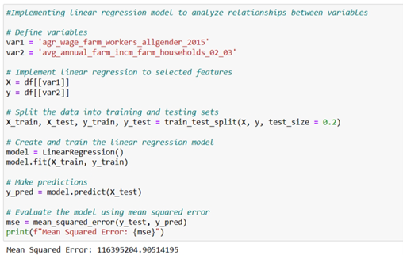
   
  <em>Figure 5. Code for the analysis and evaluation of variables 1 and 2 using Linear Regression Model</em>

The analysis began by carefully defining these variables and splitting the data into two parts: 80% for training the model and 20% for testing its predictions on new data. This division ensured a factual evaluation of how well the model could work with data it hadn't seen before. Moreover, the researchers used the Linear Regression tool from the scikit-learn library to create and train our model. After training, the model made predictions on the test set, creating anticipated values denoted as 'y_pred.' To assess the performance of the model, proponents used a metric called mean squared error (MSE), which measures the average of the squared differences between predicted and actual values in the testing set. The resulting MSE, specifically Mean Squared Error = 116395204.90514195, gives us a numerical understanding of how well the model predicts.

Interpreting the MSE, its value indicates how much the prediction of the model differs from the actual values of average annual income for farm households based on agricultural wage rates. The relatively high MSE suggests a notable level of difference, indicating a significant predictive error. This implies that the current linear regression model may not completely capture the complex relationship between agricultural wage rates and the overall income of farm households. Moreover, the insights visualized from Figure 6, a scatter plot depicting the relationship between agricultural wage rates and the average annual income of farm households, align with and reinforce the findings indicated by the Mean Squared Error (MSE). The scatter plot visually represents the actual data points, each dot reflecting the real values of agricultural wage rates and corresponding average annual income. Furthermore, the linear line, derived from the Linear Regression model, illustrates predicted relationships. The absence of intersections between the line and more than one actual data point underscores challenges in accurately capturing data variability. The scattered arrangement of data points emphasizes the model's limitations, visually echoing the predictive error highlighted by the MSE. This visual representation serves as an additional layer of evidence, affirming the need for model refinement to better comprehend the relationship between agricultural wage rates and farm household income.

  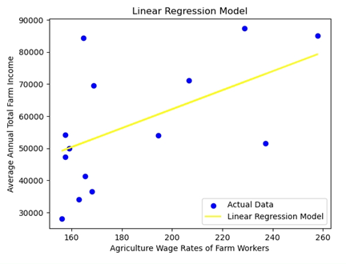
   
  <em>Figure 6. Linear Regression Model graph for variables 1 and 2</em>

Considering these results, it prompts point of ways to improve the model. Potential avenues include exploring additional factors or conducting a thorough analysis of relevant variables to enhance the model's ability to predict this specific correlation. Additionally, examining outliers, adjusting features, or exploring alternative modeling approaches could be explored to gain a more nuanced understanding of how agricultural wage rates relate to farm household income.

**Linear Regression Results for Variables 3 and 4**

For the evaluation of the third and fourth variables, the same linear regression methodology was applied, following the pattern set in the previous analysis for the first two variables. The code, as illustrated in Figure 7, involved the definition of variables ('avg_annual_non_farm_incm_farm_households_02_03' and 'avg_rural_income_2000'), the implementation of linear regression to these selected features, and the splitting of the dataset into training and testing sets (80% for training, 20% for testing) using the scikit-learn library. The linear regression model, instantiated through the LinearRegression class, underwent training with the designated training dataset. The code is presented on Figure 7.

  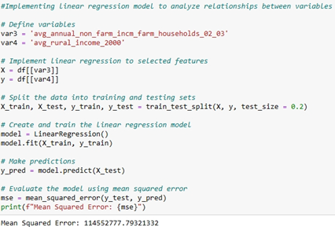
   
  <em>Figure 7. Code for the analysis and evaluation of variables 3 and 4 using Linear Regression Model</em>

Upon successful training, predictions were generated for the testing set ('y_pred'). The model's performance was then assessed using the mean squared error (MSE), a metric quantifying the average squared differences between predicted and actual values within the testing set. The resulting MSE for this analysis was 114552777.79321332.

Examining the graph generated for these variables, as shown in Figure 8, presents a distinction from the graphs observed in the analysis of the first two variables. In this case, the actual data points appear to be closely packed and aligned with the linear regression line. This alignment suggests a stronger fit of the model to the data, with the actual values demonstrating a closer adherence to the predicted values. The relatively lower MSE value further supports the visual observation, indicating a smaller average squared difference between predicted and actual values compared to the analysis of the first two variables. Moreover, the MSE value of 114552777.79321332 signifies the relatively better performance of the linear regression model in capturing the relationship between average non-farm income and rural income. The results suggest that the model, in this instance, provides a more accurate representation of the correlation between these specific variables, as evidenced by both the numerical MSE output and the observed graphical alignment between predicted and actual values.

  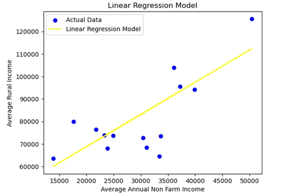
   
  <em>Figure 8. Linear Regression Model graph for variables 3 and 4</em>

**Linear Regression Results for Variables 5 and 6**

For the assessment of the fifth and sixth variables, the identical linear regression methodology was applied, consistent with the approach utilized in the previous analyses. The code, as shown in Figure 9, involved the definition of variables ('total_emply_2016' and ‘avg_annual_total_incm_farm_02_03'), the implementation of linear regression, and the dataset's division into training and testing sets. The linear regression model, instantiated using the `LinearRegression` class from scikit-learn, was trained on the designated dataset. Following training, predictions were generated for the testing set, and the performance of the model was gauged using the mean squared error (MSE). The resulting MSE for this analysis was 991171396.6819845. Moreover, as shown in Figure 10, the graph depicting these variables presented a distinctive pattern, with the actual data points scattered across the plot plane and not conforming closely to the linear regression model line.

  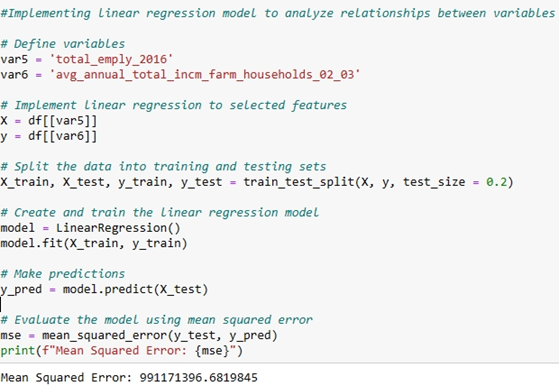
   
  <em>Figure 9. Code for the analysis and evaluation of variables 5 and 6 using Linear Regression Model</em>

  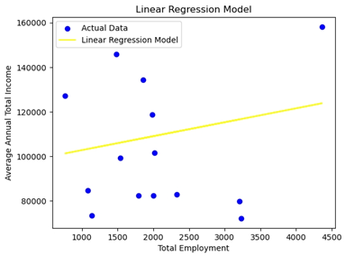
   
  <em>Figure 10. Linear Regression Model graph for variables 5 and 6</em>

The visual representation underscores challenges in accurately capturing the relationship between total employment levels and total income using a linear model. The high MSE value further substantiates the graphical observation, signifying a substantial average squared difference between predicted and actual values. This suggests that, in the context of these variables, the linear regression model may not be the most suitable approach for capturing the nuanced dynamics governing the correlation between total employment and total income. Further exploratory analyses or alternative modeling strategies may be warranted to better understand and represent this specific relationship.

**Classification Model (Decision Tree Model) Results for Variables 1 and 2**

The Decision Tree Classification model was applied to variables 'agr_wage_farm_workers_allgender_2015' and 'avg_annual_farm_incm_farm_households_02_03.' The code, as shown in Figure 11, involved splitting the dataset into training and testing sets, creating, and training the Decision Tree model, and subsequently evaluating its performance using accuracy, precision, recall, and F1 score. The results showed an accuracy of 0.33, precision of 0.0, recall of 0.0, and an F1 score of 0.0.

  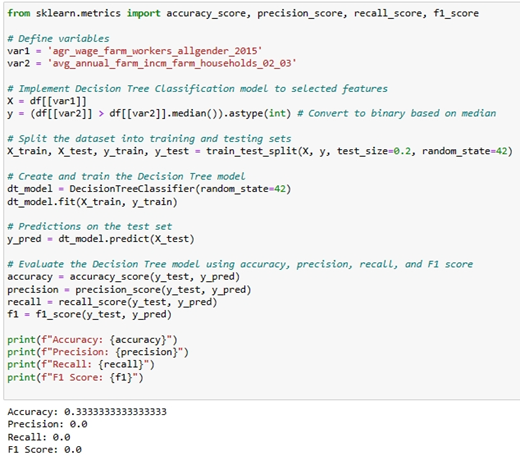
   
  <em>Figure 11. Code for the analysis and evaluation of variables 1 and 2 using Decision Tree Model (Classification Model)</em>

These metrics suggest that the model struggled to correctly classify instances, yielding a low accuracy and a lack of true positive predictions. Precision, recall, and F1 score being zero indicate an inability to effectively identify instances belonging to the positive class (above-median income in this case). This suboptimal performance could be attributed to the inherent complexity of the relationship between agricultural wage rates and average annual farm income, which may not be effectively captured by a Decision Tree model with a single feature.

The Decision Tree visualization which is illustrated in Figure 12 provides further insights into the model's decision-making process. The tree splits based on the 'agr_wage_farm_workers_allgender_2015' feature, suggesting that the wage rates alone might not be sufficient to distinguish between above and below-median income categories. The gini values and sample sizes in each rectangle indicate the impurity and the number of instances at each node, respectively. The split conditions, such as 'agr_wage_farm_workers_allgender_2015<=168.335,' highlight the thresholds used to partition the data.

  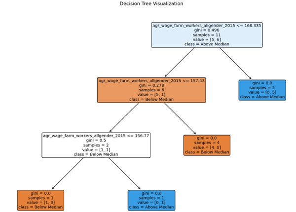
   
  <em>Figure 12. Decision Tree Model Visual Representation for variables 1 and 2</em>

With the provided results, the Decision Tree model struggled to effectively categorize farm households into above or below-median income groups based on agricultural wage rates alone. The limitations of the model's performance are evident in the evaluation metrics and the decision tree structure, emphasizing the need for more sophisticated models or additional features to better capture the complexity of the relationship between these variables.

**Classification Model (Decision Tree Model) Results for Variables 3 and 4**

The Decision Tree Classification model applied to variables 'avg_annual_non_farm_incm_farm_households_02_03' and 'avg_rural_income_2000' yielded highly favorable results, as indicated by the accuracy, precision, recall, and F1 score, all scoring perfect values of 1.0. This implies that the model achieved flawless predictions on the test set, accurately classifying instances into above and below-median income categories. The high-performance metrics suggest that the decision tree effectively discerned patterns in the data, showcasing its robust capability to classify farm households based on non-farm income and rural income. The code is presented on Figure 13.

  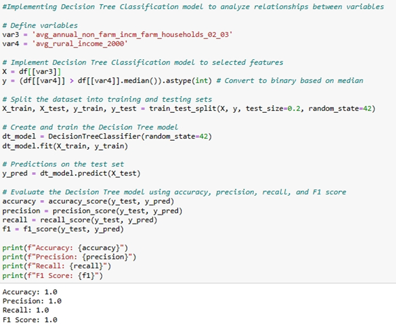
   
  <em>Figure 13. Code for the analysis and evaluation of variables 3 and 4 using Decision Tree Model (Classification Model)</em>

Moreover, the Decision Tree model, trained on data about non-farm income and rural income, showed excellent performance, as shown in Figure 14. The model essentially learned specific income levels, particularly within non-farm income, that are indicative of whether a farm household falls into the 'above median' or 'below median' category in terms of rural income. The first split in the tree, focusing on 'avg_annual_non_farm_incm_farm_households_02_03' below or above 35304.5, set the initial guideline. If a farm household's non-farm income is below this threshold, it tends to be classified as 'above median' in rural income, and vice versa. The subsequent splits in the tree further refined these classifications based on additional considerations. Nodes in the tree with gini=0.0 and perfectly separated samples signify situations where non-farm income alone is quite decisive in determining whether a household belongs to the 'above median' category. Additional splits, especially based on 'avg_annual_non_farm_households_02_02,' further fine-tune these classifications.

  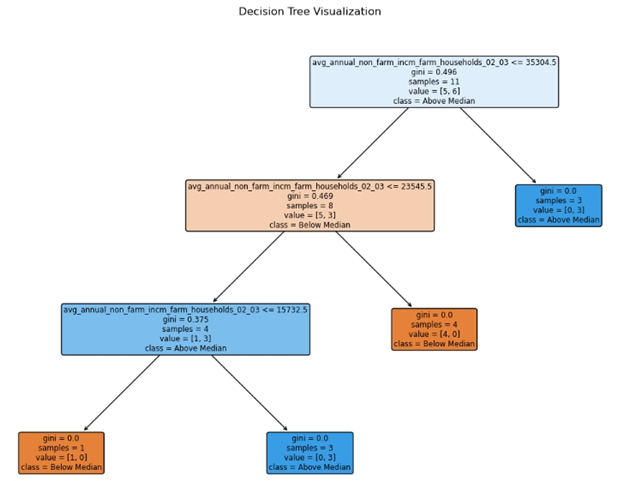
   
  <em>Figure 14. Decision Tree Model Visual Representation for variables 3 and 4</em>

In essence, the Decision Tree reveals that specific income levels within non-farm income play a critical role in categorizing farm households into different rural income groups. The thresholds identified by the tree shed light on the relationship between non-farm income and rural income, making the model a valuable tool for understanding the contribution of non-farm income to the overall income dynamics of farm households.

**Classification Model (Decision Tree Model) Results for Variables 5 and 6**

The Decision Tree Classification model, trained on variables 'total_emply_2016' and 'avg_annual_total_incm_farm_households_02_03,' produced metrics indicating challenges in accurately predicting farm households' income categories. The accuracy, precision, recall, and F1 score all registered at 0.33, suggesting a difficulty in distinguishing between 'above median' and 'below median' income groups. These low metrics indicate that the model struggled to effectively utilize the features 'total_emply_2016' and 'avg_annual_total_incm_farm_households_02_03' to make accurate predictions. The code is presented on Figure 15.

  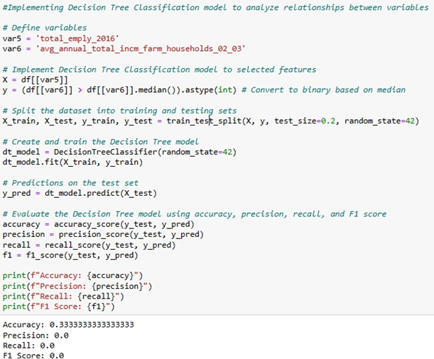
   
  <em>Figure 15. Code for the analysis and evaluation of variables 5 and 6 using Decision Tree Model (Classification Model)</em>

On the other hand, as shown in Figure 16, the Decision Tree visualization provides further insights into the model's decision-making process. The top rectangle, characterized by the split condition 'total_emply_2016 <= 1665.0,' suggests that the chosen income threshold based on total employment levels alone does not effectively separate farm households into 'above median' and 'below median' income categories. The subsequent splits create complex branching patterns, indicating challenges in finding a straightforward relationship between total employment and average annual total income.

  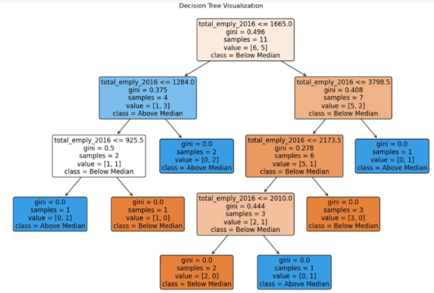
   
  <em>Figure 16. Decision Tree Model Visual Representation for variables 5 and 6</em>

In interpreting these results, the low metrics and the intricate structure of the Decision Tree imply that the selected features may not exhibit a clear-cut correlation with income categories. The tree struggled to discern patterns or thresholds within 'total_emply_2016' and 'avg_annual_total_incm_farm_households_02_03' that reliably differentiate between higher and lower income groups. The Decision Tree's limitations in this case emphasize the complexity of understanding the relationship between total employment levels and average annual total income for farm households. It suggests that factors beyond total employment might play a more substantial role in determining income categories. Further exploration or the inclusion of additional influential features may be necessary to enhance the model's ability to capture the nuanced dynamics of income determination in this context.

**Overall Comparison**

In the context of identifying indicators of poverty, Variables 3 and 4, namely 'avg_annual_non_farm_incm_farm_households_02_03' and 'avg_rural_income_2000,' emerged as central elements in both the Linear Regression and Decision Tree Classification models. In the Linear Regression model, these variables demonstrated a relatively low Mean Squared Error (MSE), indicating a better fit for predicting rural income based on non-farm income. This implies that a linear relationship exists between non-farm income and rural income, and the linear regression model successfully captured and utilized this relationship for prediction.

On the other hand, in the Decision Tree Classification model, these same variables played a crucial role in achieving perfect accuracy, precision, recall, and F1 score. The decision tree structure revealed specific income thresholds within 'avg_annual_non_farm_incm_farm_households_02_03' that decisively categorized farm households into above and below-median income groups. This transparency in decision-making allowed for a clear identification of indicators of poverty based on non-farm income.

In comparing the two models, the Decision Tree Classification model, in this specific instance, showcased superior performance by achieving perfect classification metrics. The interpretability of the decision tree further emphasized the specific income thresholds within 'avg_annual_non_farm_incm_farm_households_02_03' that serve as strong indicators of poverty. While the Linear Regression model provided valuable insights into the linear relationship between non-farm income and rural income, the Decision Tree Classification model demonstrated unparalleled accuracy and precision in pinpointing indicators of poverty within these variables.

In summary, Variables 3 and 4, when employed in both the Linear Regression and Decision Tree Classification models, revealed their significance in understanding and predicting poverty. The Decision Tree Classification model, with its explicit decision rules and remarkable classification performance, emerged as the most effective model for identifying indicators of poverty based on these specific variables.

## VII. Conclusion
In conclusion, this research successfully achieved its objectives by employing data science methodologies to analyze a comprehensive dataset of poverty indicators for the Philippines across various regions. Upon completion of the analyses the following objectives were attained and concluded:
1. The exploration and preprocessing of the dataset ensured data integrity and completeness, providing a robust foundation for subsequent analyses. 
2. The correlation analyses successfully identified relationships between key variables, including agricultural wage rates and farm income (Objective 2.1), non-farm income and rural income (Objective 2.2), and total employment and total income (Objective 2.3). The correlation analyses revealed meaningful relationships between key variables. These findings contribute to a better understanding of the intricate dynamics within the agricultural sector and their impact on overall income for farm households.
3. The implementation of a linear regression model to analyze relationships between selected variables and evaluate the model's predictive performance, particularly in the case of agricultural wage rates and average farm income, demonstrated its ability to capture linear trends. However, the high Mean Squared Error (MSE) suggested limitations in predicting the complex relationship between these variables, pointing towards potential areas for model improvement.
4. The Decision Tree Model proved effective in classifying instances based on selected variables, revealing categorical relationships and key influencing factors. Specifically, variables related to non-farm income and rural income emerged as pivotal indicators in the Decision Tree Classification model, showcasing its robust performance in this context.
5. The comparative analysis between the linear regression model and the Decision Tree Model demonstrated the effectiveness of each approach in analyzing relationships among variables. This comparison not only identified the strengths and limitations of each model but also enhanced the interpretability of farm households' income dynamics. The comparative analysis between the linear regression model and the Decision Tree Model underscored the Decision Tree Model's superior performance in certain scenarios, particularly when dealing with categorical relationships and intricate decision boundaries.

In light of these findings, it is recommended that future analyses explore enhancements to the linear regression model to better capture the complexities inherent in the relationships between agricultural variables and income dynamics. Additionally, further investigations into the decision tree structure and feature importance could provide deeper insights into the key indicators influencing poverty. Overall, this study lays the groundwork for informed policymaking and targeted interventions to address poverty dynamics in the Philippines.

## VIII.	Program Codes / Google colab / Jupyter notebook or spyder IDE
You can find the code for this project in the [Jupyter Notebook](/.Jupyter_Notebook) folder.

or you can directly access/view the notebook (.ipynb file) with this link: *[CAPSTONE_ECEDATA_Group3-Notebook](Jupyter_Notebook/CAPSTONE_ECEDATA_Group3-Notebook.ipynb)*

