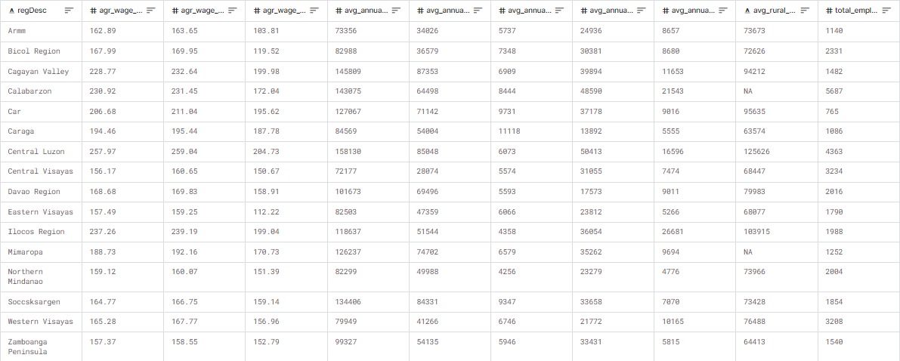
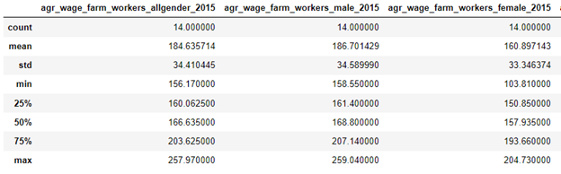
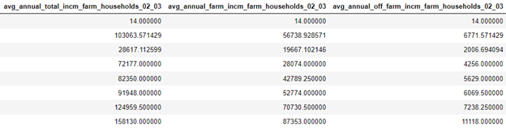
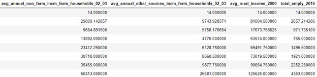

# ANALYZING THE RELATIONSHIP OF FEW POVERTY INDICATORS IN THE PHILIPPINES BY REGION

**A Course Requirement for the Subject Data Science and Artificial Intelligence**

**Submitted by:** 
*T4A - Group 3*
- Arellano, Aldrich E.
- Coronel, Ericka May B.
- Fadol, Noelle Joshua N.
- Mendoza, Joshua Jericho L.

**Submitted to:** Labastilla, Aisa M.

**Date:** January 23, 2024

## I.	Introduction / Problem Statement
In the intricate web of the Philippine socio-economic landscape, the persistent challenge of poverty poses an obstacle, hindering the nation's path to comprehensive development. Despite commendable economic growth, poverty endures, characterized by low income, constrained employment opportunities, and limited access to essential services. 

Aligning itself with the global commitment encapsulated in the Sustainable Development Goal (SDGs), the Philippines underscores its dedication to fostering a more equitable society. Embracing the principles of SDG 1: "No Poverty," the nation recognizes the importance of eradicating all facets of poverty, ensuring that every individual has equal access to the essentials necessary for a dignified life.

In the fabric of a nation's economic landscape, one of the pivotal contributors is the rural economy, wielding both the potential for prosperity and the challenges of poverty. Rooted in the vast expanses beyond urban centers, the rural economy encompasses a diverse range of agricultural activities, non-farm enterprises, and local industries. Its significance extends far beyond the idyllic scenes of farmland, encompassing the livelihoods of a substantial portion of the population.
  
For the Philippines, rural economies is considered as the backbone of the agricultural sector, nurturing the cultivation of crops and the rearing of livestock that form the bedrock of food security. Beyond agriculture, these economies host a spectrum of non-farm activities, from small-scale enterprises to traditional crafts, creating a web of interconnected economic activities that sustains communities.

However, while the rural economy is a wellspring of economic contributions, it also grapples with the shadows of poverty. The challenges are manifold, encompassing factors such as limited access to resources, market fluctuations, and vulnerability to climate change. As a result, a significant proportion of the rural populace contends with lower income levels, constrained employment opportunities, and disparities in access to essential services. In relation to this, understanding the dynamics of the rural economy as a contributor to both economic growth and poverty is essential for crafting effective policies.

Income disparities in the rural economy serve as a testament to the pervasive hold of poverty, as a significant portion of the population remains below the national poverty line. Limited stable employment opportunities increase vulnerability, exposing individuals and families to a state of socio-economic instability. With these, a more in-depth analysis of these indicators, including rural income, agricultural wages, non-farm income, and employment, will be undertaken to glean a comprehensive understanding of the factors contributing to the issue of poverty for targeted and effective interventions to address the root causes and foster inclusive progress.

## II. Review of Related Literature
The review of related literature is a critical component of any research endeavor, serving as the intellectual foundation upon which a study is built. This section provides a comprehensive examination of existing scholarly works, theories, and empirical studies relevant to the poverty of the Philippines, highlighting the rural or agricultural income. By delving into the wealth of knowledge already available, the proponents gain insights and establishes the context within which the current study contributes.

*Defining Poverty*

Poverty is a pervasive and complex socio-financial phenomenon that continues to task countries international, affecting tens of millions of people and communities. In modern-day discourse, poverty is generally defined as a multifaceted state or circumstance marked through the insufficient financial sources that restrict individuals, families, and groups from attaining a minimum widespread of living critical for a thriving existence. This deprivation extends beyond earnings constraints, encompassing the incapability to access fundamental requirements including decent housing, clean water, nutritious meals, and critical healthcare. The complexity of poverty is underscored by its correlation with various factors, which include race, sexual identity, sexual orientation, and constrained academic opportunities [[1]](https://www.investopedia.com/terms/p/poverty.asp)

The World Bank Organization describes poverty in this way: “Poverty is hunger. Poverty is lack of shelter. Poverty is being sick and not being able to see a doctor. Poverty is not having access to school and not knowing how to read. Poverty is not having a job, is fear for the future, living one day at a time. Poverty has many faces, changing from place to place and across time, and has been described in many ways.  Most often, poverty is a situation people want to escape. So, poverty is a call to action - for the poor and the wealthy alike - a call to change the world so that many more may have enough to eat, adequate shelter, access to education and health, protection from violence, and a voice in what happens in their communities” [[2]](https://disasterphilanthropy.org/resources/people-experiencing-poverty/).

Determinants of Poverty
Poverty indicators are measurable and quantifiable variables that provide insights into the monetary, social, and typical well-being of people, households, or communities, aiding in the assessment of their living requirements and the volume in their deprivation. These indicators serve as critical gear for identifying, studying, and addressing poverty.
Income inequality stands as a pivotal determinant within the complex panorama of poverty. There are studies that underscore a compelling correlation among heightened earnings inequality and escalating poverty rates. The usage of the Gini coefficient, an extensively standard metric for gauging earnings distribution, continually famous that nations characterized with the aid of reported profits disparities simultaneously grapple with increased tiers of poverty [3].
The perpetuation of poverty cycles is substantially influenced by using racial and ethnic disparities, as illuminated by latest investigations led by Beech, et al. (2020). These studies emphasize the lifestyles of systemic boundaries that disproportionately affect minority agencies, resulting in an augmented susceptibility to poverty. The unequal apportionment of possibilities and assets among awesome racial and ethnic communities exacerbates pre-current financial inequalities [4].
The feminization of poverty is propelled by gender-based wage gaps, limited access to education, and restricted employment opportunities, as articulated by Duflo (2012). Kabeer (2016) have conducted contemporary studies that delve into the nuanced challenges of gender disparities, shedding light on the dynamic nature of poverty concerning gender [5] [6].
The intricate relationship between urbanization, migration, and poverty introduces a nuanced layer to poverty dynamics. Recent scholarly contributions by Glaeser, Kahn, & Rappaport (2019) and Henderson (2019) provide insights into the contemporary challenges and opportunities arising from urbanization in the context of poverty. Glaeser, Kahn, & Rappaport (2019) delve into the multifaceted aspects of urban development and its implications for economic disparities, while Henderson (2019) explores the intricate relationship between urbanization and poverty dynamics. As global trends continue to shift towards increased urbanization, a comprehensive understanding of the complex interplay between urban development and poverty becomes essential for formulating sustainable urban policies [7] [8].

Impacts of Poverty
Poverty, a pervasive and enduring international undertaking, extends its a long way-accomplishing implications throughout people, communities, and entire societies. The complicated courting among poverty and health has garnered extensive attention in modern research. Siddiqi et al. (2017) and Patel et al. (2018) contribute to this information, elucidating the unfavorable results of poverty on both physical and mental well-being. Individuals ensnared in poverty frequently deal with better quotes of continual illnesses, intellectual health problems, and face boundaries to having access to important healthcare offerings. This nexus between poverty and fitness underscores the urgent need for comprehensive interventions that address the health disparities perpetuated by means of financial deprivation [9] [10].
Recent investigations by using Duncan and Murnane (2014) and Hanushek and Woessmann (2015) delve into the tricky instructional influences of poverty. These studies resolve a cyclical project in which poverty acts as a barrier to great education, while restricted academic attainment, in turn, perpetuates the cycle of poverty. The persisting hole in educational effects for youngsters from impoverished backgrounds accentuates the urgency of centered educational guidelines to break the vicious cycle and foster identical opportunities for all [11] [12].
Beyond limiting get right of entry to opportunities, poverty resonates profoundly in the financial realm. Krause and Rinne (2015) and Edmonds and Schady (2012) illuminate the cyclical nature of poverty, in which limited financial resources occur as diminished employment opportunities. This cycle exacerbates financial hardships for affected people and households, reinforcing the imperative for economic guidelines that deal with the basis causes of poverty and stimulate sustainable economic boom [13] [14].
The social and mental toll exacted with the aid of poverty emerges as a poignant theme in current studies through Mani et al. (2013) and Helliwell et al. (2020). This research finds the pervasive stress and stigma associated with poverty, contributing to social isolation and an average faded sense of proper-being. Individuals grappling with poverty regularly bear the weight of shame and feelings of inadequacy, in addition impeding their capability to break unfastened from the entwining cycle of deprivation. Understanding and addressing the social and psychological dimensions of poverty are essential for designing holistic interventions that empower people to triumph over the challenges posed via financial adversity [15] [16].
The inter-generational transfer of poverty takes center level in research through Dahl and Lochner (2012) and Almond et al. (2014). These studies light up the iconic results confronted with the aid of youngsters born into impoverished environments, where the cycle of poverty is perpetuated across generations. Recognizing the long-time period implications of poverty underscores the significance of interventions that break this inter-generational cycle, fostering opportunities for future generations to escape the clutches of financial deprivation [17] [18].

Poverty Dynamics in the Philippines
According to the Preliminary Results of the Family Income and Expenditure Survey (FIES) in 2021, the poverty incidence among the population, defined as the percentage of Filipinos with per capita income insufficient to meet basic food and non-food needs, stood at 18.1 percent. This equates to approximately 19.99 million Filipinos living below the poverty threshold of PhP 12,030 per month for a family of five. The subsistence incidence, representing the proportion of Filipinos with income inadequate for basic food needs, saw a slight increase to 5.9 percent in 2021. It was estimated that a family of five requires at least PhP 8,379 per month to fulfill their basic food requirements). In terms of families, approximately 3.50 million families, or 13.2 percent, were deemed poor in 2021. Conversely, the subsistence incidence among families was noted at 3.9 percent, equivalent to 1.04 million families falling below the food poverty line. Figure 1 shows this poverty and subsistence incidence statistics in the Philippines from 2015-2018 [19]. 

## III.	Gathered Data / Dataset 
The dataset employed in this project is a comprehensive compilation of economic and agricultural indicators, providing a detailed snapshot of the socio-economic insight across various regions in the Philippines. These indicators encompass a wide array of quantitative measures that capture the dimensions of economic and agricultural activities, shedding light on the characteristics and disparities that exist among different geographic areas within the country.

Titled *"A Few Poverty Indicators for the Philippines by Region"*, the dataset has been sourced from Kaggle.com, with the last recorded update dating back to the year 2018. Kaggle is a renowned platform that hosts datasets and facilitates collaborative data science projects. This particular dataset serves as a valuable resource for understanding poverty dynamics in the Philippines, providing insights into various indicators across different regions of the country. The dataset is shown on Figure 1. 

  
   
  <em>Figure 1. Dataset</em>

Within this dataset, economic indicators encompass a range of variables such as income, wages, and employment. These indicators serve as crucial metrics for assessing the financial health and productivity of each region. This regional approach acknowledges the diversity within the Philippines, recognizing that economic and agricultural dynamics can vary significantly from one region to another due to factors. Presented below are the description of the columns in the dataset:

1.	regDesc: Region description, indicating the name of each region in the dataset.
2.	agr_wage_farm_workers_allgender_2015: Average agricultural wage for farm workers of all genders in 2015.
3.	agr_wage_farm_workers_male_2015: Average agricultural wage for male farm workers in 2015.
4.	agr_wage_farm_workers_female_2015: Average agricultural wage for female farm workers in 2015.
5.	avg_annual_total_incm_farm_households_02_03: Average annual total income for farm households in 2002-2003.
6.	avg_annual_farm_incm_farm_households_02_03: Average annual farm income for farm households in 2002-2003.
7.	avg_annual_off_farm_incm_farm_households_02_03: Average annual off-farm income for farm households in 2002-2003.
8.	avg_annual_non_farm_incm_farm_households_02_03: Average annual non-farm income for farm households in 2002-2003.
9.	avg_annual_other_sources_incm_farm_households_02_03: Average annual income from other sources for farm households in 2002-2003.
10.	avg_rural_income_2000: Average rural income in the year 2000.
11.	total_emply_2016: Total employment in the year 2016.
    
The dataset is a small-sized tabular dataset, having 11 columns and 17 rows, wherein the types of variables include both numerical values in decimals (e.g., average wages, income figures) and categorical values in strings (e.g., region descriptions). The provided dataset has 11 columns to represent information for different regions in the Philippines. The row of the dataset corresponds to each of the regions in the country excluding National Capital Region; hence, giving a total of 16 rows. These include Autonomous Region in Muslim Mindanao (ARMM), Bicol Region, Cagayan Valley, CALABARZON, Cordillera Administrative Region (CAR), Caraga, Central Luzon, Central Visayas, Davao Region, Eastern Visayas, Ilocos Region, MIMAROPA, Northern Mindanao, SOCCSKSARGEN, Western Visayas, and Zamboanga Peninsula. Presented in Figure 2 is the descriptive statistics of the dataset which include the characteristics per category, such as number of not-empty values, mean, standard deviation, minimum value, and maximum value.

  
  
  
   
  <em>Figure 2. Descriptive statistics of the dataset</em>

In terms of the dataset's constraints, it covers only 16 out of the 17 regions in the country, with the National Capital Region (NCR) being the excluded region. Additionally, the dataset contains two missing values, specifically related to the average rural income for the year 2000 in Region IV, encompassing CALABARZON (IV-A) and MIMAROPA (IV-B).

Furthermore, the dataset spans different years for various variables: 2015 for gender-related data, 2002 to 2003 for household income-related data, 2000 for average rural income, and 2016 for total employment. The confined timeframe may impose limitations on the ability to observe long-term trends or assess the repercussions of economic changes over extended periods. Moreover, certain variables, like 'agr_wage_farm_workers_allgender_2015,' present a single-year snapshot, potentially missing dynamic changes that unfold over time. This temporal constraint may hinder a comprehensive understanding of evolving trends and shifts in the variables under consideration.

*Link of the Dataset:* [Dataset - A few poverty indicators for philippines by region](https://www.kaggle.com/datasets/statchaitya/a-few-poverty-indicators-for-philippines-by-region/data )

## IV.	Objectives
The primary objective of the study is to conduct a comprehensive analysis of the dataset containing key poverty indicators for the Philippines by region, leveraging data science methodologies, with the aim of having an overview of the status of poverty in each region. Specifically, this study aims to:
1. Explore and preprocess the dataset focusing on variables related to agricultural wages, average incomes, and total employment to ensure data integrity and completeness;
2. Conduct correlation analyses to identify relationships between variables, specifically the following:

   2.1. Agricultural wage rates and farm income

   2.2. Non-farm income and rural income

   2.3. Total employment and total income
   
4. Implement a linear regression model to analyze the relationships between the selected and specified variables and evaluate the model's ability to predict the linearity of these variables and assess their respective impacts on overall income for farm households;
5. Employ a Decision Tree Model to classify instances based on the selected variables to reveal categorical relationships and key influencing factors and evaluate the model’s performance for a comprehensive understanding of farm households' income dynamics; and
6. Conduct a comparative analysis between the linear regression model and the Decision Tree Model in terms of their effectiveness in analyzing the relationships among variables to identify the strengths and limitations of each model for a more robust interpretation of farm households' income dynamics.

## V.	Conceptual
The conceptual framework delineates a methodological roadmap for achieving the primary objective of training and evaluating a dataset, focusing on agricultural wages, average incomes, and total employment. It entails a systematic progression through essential stages, including data exploration, cleaning, and feature selection. The subsequent focus on correlation analysis, complemented by the implementation of linear regression and a Decision Tree Model, unravel relationships between variables. Concluding with a comparative analysis, this framework guides a comprehensive understanding of the relationships by evaluating the model’s strengths and limitations in analyzing relationships among variables.

In the pursuit of the main objective of training and evaluating the gathered data, a comprehensive conceptual framework is outlined below:

1.	Data Exploration and Cleaning:
    -	Conduct an in-depth exploration of the dataset to comprehend its structure, types, and distribution characteristics.
    -	Address missing values, outliers, and inconsistencies through rigorous data cleaning procedures to ensure data integrity.
2.	Feature Selection:
    -	Prioritize relevant columns related to agricultural wages, average incomes, and total employment based on their significance for the analysis.
    -	Perform a detailed evaluation of each feature, considering statistical measures and domain knowledge to identify and retain influential variables.
3.	Correlation Analysis:
    - Conduct a thorough correlation analysis to ascertain relationships between key variables.
    - Focus on specific correlations, namely agricultural wage rates and farm income, non-farm income and rural income, and total employment and total income.
4.	Linear Regression Model:
    - Develop and implement a linear regression model to analyze relationships and assess its predictive ability.
5.	Decision Tree Model:
    - Create and utilize a Decision Tree Model for classification and understanding categorical relationships.
6.	Comparative Analysis:
    - Compare the performance of the linear regression model and the Decision Tree Model.
    - Evaluate their strengths and limitations in analyzing relationships among variables.
  
## VI. Data and Results

## VII. Conclusion

## VIII.	Program Codes / Google colab / Jupyter notebook or spyder IDE
You can find the code for this project in the [Code](./Code) folder.

or you can directly access/view the notebook (.ipynb file) with this link: *[Jupyter Notebook](Code/CAPSTONE_ECEDATA_Group3.ipynb)*

## IX. References

